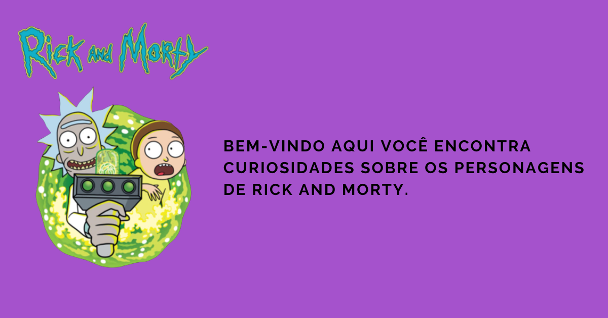

# Em construção 🏗

## Descrição do projeto. 📝

App desenvolvido para fins educacionais. Nele aprendi sobre a criação de Components, ReactNative Hooks, Animações com a lib Lottie e navegação entre telas usando o React Navigation.

## Features ⚙ 
- [x] Tela de Welcome.
- [x] Animação da tela de welcome.
- [x] Component/animação de loading.
- [x] Tela de Home.
- [x] Consumo da API.
- [x] Listagem dos personagens.
- [ ] Tela com informações detalhadas do personagem que o usuário clickar.

## Demonstração da aplicação 🤳

## Projeto em sua versão web 💻

## https://resonant-sherbet-ed40a2.netlify.app

### Link do repositório versão web 💻

## https://github.com/samuelrms/Rick-and-Morty-cards
